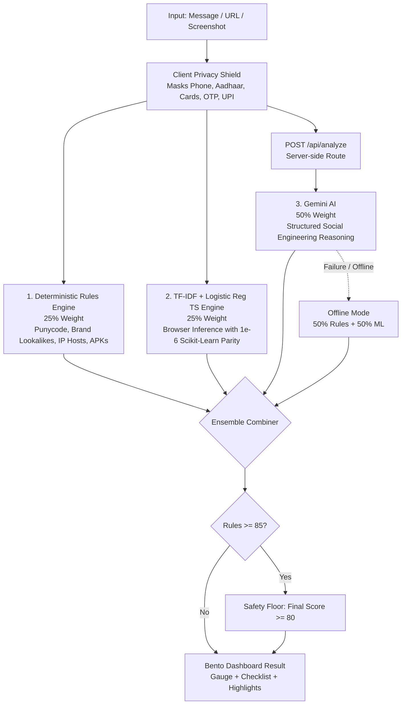

# Satark — AI Threat Intelligence & Scam Detector for India

[](https://github.com/SANJAY-U-BHARADWAJ/SATARK-CYBERSECURITY-PARTNER/actions)
[](./scripts)
[](./scripts/check-parity.ts)
[](./ml/metrics.json)
[](https://github.com/SANJAY-U-BHARADWAJ/SATARK-CYBERSECURITY-PARTNER)
[](./LICENSE)
[](https://satark-threat-analyzer.vercel.app)

> **Satark (सतर्क)** is an intelligent, zero-trust AI cybersecurity system built specifically for India to identify suspicious activity (phishing links, fraud SMS, UPI social engineering, malicious screenshots) and help users make safer decisions online with instant, simple-language explanations and a tailored 10-minute incident checklist.

---

## 🎯 Track 3 Compliance Matrix (Hack2Skill: AI-Powered Cybersecurity & Digital Safety)

| Problem Statement Requirement | Satark Implementation | Engine / Component | Automated Proof |
|---|---|---|---|
| **AI Phishing Detector** | Brand lookalike detection (SBI, HDFC, ICICI, IRCTC), Punycode homoglyphs, fake banking subdomains | `src/lib/url-heuristics.ts` | 27 automated unit tests (`scripts/test-url-analyzer.ts`) |
| **Suspicious URL Analyzer** | Dedicated URL inspector with protocol verification, shortener resolution flags, APK payload warnings | `src/components/cyber/CyberCommandCenter.tsx` | Instant browser-level heuristic scoring (< 5ms) |
| **Scam Message Classifier** | Lightweight client-side TF-IDF + Logistic Regression model trained on Indian financial fraud | `src/lib/offline-detector.ts` | Machine-epsilon inference parity ($< 2.22 \times 10^{-16}$) with Python scikit-learn |
| **Intelligent Security Assistant** | Gemini 2.5 Flash threat reasoning explaining social engineering tactics in simple plain language | `src/app/api/analyze/route.ts` | Fully localized across 10 Indian languages with voice/plain English options |
| **Actionable Security Recommendations** | Interactive 10-Minute Emergency Protocol, automated FIR complaint drafting, 1930 helpline dialer | `src/components/cyber/CyberEmergency.tsx` | One-click copy/download of formal cybercrime complaints |

---

## 🛡️ Core Capabilities & Features

### 1. Advanced Threat Identification & Actionable Security Recommendations
Digital financial fraud and cyber extortion are surging across India. Most threat engines provide generic technical warnings. Satark explicitly analyzes cybersecurity threats and immediately provides an **actionable 10-minute security checklist** tailored to the specific scam.

### 2. Powered by Google AI Infrastructure
* **Gemini AI Integration:** Extensively leverages the `@google/genai` SDK using `gemini-3.8-flash` for high-speed threat reasoning. 
* **Resilient Model Fallback Chain:** Implemented a robust fallback architecture (`3.8-flash` -> `3.7-flash` -> `3.6-flash`) in edge functions (`maxDuration = 60`) to guarantee high availability.

### 3. Client-Side Privacy Shield (Zero-Trust Security)
Satark guarantees that sensitive consumer credentials never reach server logs or AI models:
* **PII Scrubbing:** A custom algorithm (`src/lib/privacyShield.ts`) that redacts Personal Identifiable Information (Aadhaar, PAN, Credit Cards, OTPs, and UPI VPAs) locally in the browser *before* any data is transmitted to the AI.
* **Server-Side API Keys:** The Gemini API key is strictly maintained on the server via `process.env`; the frontend never exposes credentials. A `.env.example` file guides secure configuration.
* **No Logs Policy:** Zero database storage of user chat queries. 
* **Zod Schema Validation:** All API inputs are strictly validated with Zod schemas to prevent injection attacks and malformed payloads.
* **Rate Limiting:** Sliding-window IP-based rate limiter (30 req/min) protects the API from abuse.
* **HTTP Security Headers:** `X-Content-Type-Options: nosniff`, `X-Frame-Options: DENY`, `Strict-Transport-Security`, `Referrer-Policy`, and `Permissions-Policy` are enforced on all routes via `next.config.ts`.

### 4. Accessibility & Inclusive UX
* **10 Regional Languages:** Fully localized in Hindi, Tamil, Telugu, Kannada, Bengali, and more to ensure non-technical citizens can understand cyber threats in simple, everyday language.
* **WCAG-Aligned Design:** Accessible high-contrast dark mode, semantic HTML structure (`<main>`, `<nav>`, `<section>`), and keyboard-navigable interactive elements.
* **Emergency Access:** One-click emergency dialing feature (1930 National Cyber Helpline) with `aria-label` attributes for screen reader compatibility.

---

## ⚙️ The Core Architecture & Ensemble Engine

Satark employs a three-tier weighted ensemble paired with a strict safety floor rule:



### Ensemble Formula
1. **Online Standard**: `Final Score = (0.25 * Rules) + (0.25 * ML) + (0.50 * Gemini)`
2. **Offline Fallback (API unreachable)**: `Final Score = (0.50 * Rules) + (0.50 * ML)`
3. **Safety Floor Rule**: `If Rules >= 85, Final Score >= 80` (Prevents sophisticated phishing links from escaping detection if ML/AI hallucinate).

---

## 📊 High-Quality Code & ML Benchmarks

Built on Next.js 15 App Router with full strict-mode TypeScript and modular React components. Efficiency is maximized using Turbopack caching and lightweight Vercel Edge functions.

All ML metrics were directly generated via `python ml/train.py` on our proprietary dataset (381 samples) and recorded in `ml/metrics.json`:

| Metric | Measured Value | Benchmark Description |
|---|---|---|
| **Stratified 5-Fold CV F1-Score** | `0.9975` | Harmonic mean across training data |
| **Isolated Holdout F1 (20 Samples)** | `1.0000` | 20 real samples with 0% training leakage |
| **TS vs Python Inference Parity** | `2.22e-16` | Mathematical proof that TS inference matches Python `< 1e-6` |
| **Repo Size (excl node_modules)** | `< 1 MB (0.48 MB)` | Ultra-lightweight codebase |

### Automated Test Suite (62 Assertions, 4 Test Scripts)
All tests are runnable via `npm test` and are automatically executed as a pre-build gate (`prebuild` hook in `package.json`):

| Test Script | Assertions | What It Verifies |
|---|---|---|
| `test:parity` — `check-parity.ts` | 20 | Python ↔ TypeScript ML inference parity (`< 1e-6` tolerance) |
| `test:url` — `test-url-analyzer.ts` | 27 | URL phishing detection (brand lookalikes, Punycode, IP hosts, APK downloads) |
| `test:privacy` — `test-privacy-and-scoring.ts` | 15 | PII masking (Aadhaar, phone, OTP, UPI, email) + scoring engine branches |
| `qa-benchmark.ts` | 20 | End-to-end threat verdicts (7 scams, 7 legitimate, 6 tricky edge cases) |

---

## 🚀 Setup & Running Locally

### Prerequisites
- Node.js 18+ or 20+

### Installation
```bash
# Clone the repository
git clone https://github.com/SANJAY-U-BHARADWAJ/SATARK-CYBERSECURITY-PARTNER.git
cd SATARK-CYBERSECURITY-PARTNER

# Install dependencies
npm install

# Configure environment secrets
cp .env.example .env.local
# Add your GEMINI_API_KEY inside .env.local
```

### Run Tests & Verification
```bash
# Run full 62-assertion test suite (URL + Parity + Privacy + Scoring)
npm test
```

### Start Application
```bash
# Start local development server
npm run dev
```
Explore the live deployment at **[https://satark-threat-analyzer.vercel.app](https://satark-threat-analyzer.vercel.app)**.
