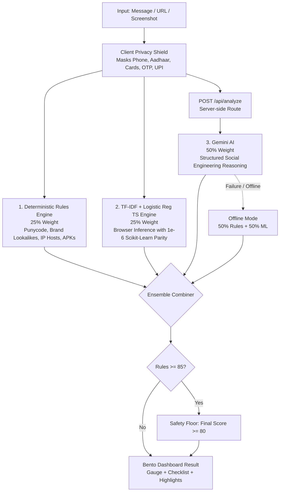

# Satark — AI Threat Intelligence & Scam Detector for India

[](./scripts)
[](./scripts/check-parity.ts)
[](./ml/metrics.json)
[](./docs/SPEC.md)

> Satark is an intelligent, privacy-first cybersecurity system built to identify suspicious activity (URLs, messages, screenshots) and help users make safer decisions online. It serves as a functional prototype that integrates an AI phishing detector, suspicious URL analyzer, scam message classifier, and an intelligent security assistant that explains potential threats in simple language.

---

## 🛡️ Core Capabilities & Features

### 1. Advanced Threat Identification & Actionable Security Recommendations
Digital financial fraud and cyber extortion are surging across India. Most threat engines provide generic technical warnings. Satark explicitly analyzes cybersecurity threats and immediately provides an **actionable 10-minute security checklist** tailored to the specific scam.

### 2. Powered by Google AI Infrastructure
* **Gemini AI Integration:** Extensively leverages the `@google/genai` SDK using `gemini-3.8-flash` for high-speed threat reasoning. 
* **Resilient Model Fallback Chain:** Implemented a robust fallback architecture (`3.8-flash` -> `3.7-flash` -> `3.6-flash`) in edge functions (`maxDuration = 60`) to guarantee high availability.

### 3. Client-Side Privacy Shield (Zero-Trust Security)
Satark guarantees that sensitive consumer credentials never reach server logs or AI models:
* **PII Scrubbing:** A custom algorithm (`src/lib/privacyShield.ts`) that redacts Personal Identifiable Information (Aadhaar, PAN, Credit Cards, OTPs, and UPI VPAs) locally in the browser *before* any data is transmitted to the AI.
* **Server-Side API Keys:** The Gemini API key is strictly maintained on the server; the frontend never exposes credentials.
* **No Logs Policy:** Zero database storage of user chat queries. 

### 4. Accessibility & Inclusive UX
* **10 Regional Languages:** Fully localized in Hindi, Tamil, Telugu, Kannada, Bengali, and more to ensure non-technical citizens can understand cyber threats in simple, everyday language.
* **UX Design:** Accessible high-contrast dark mode design with a one-click emergency dialing feature (1930 Cyber Helpline).

---

## ⚙️ The Core Architecture & Ensemble Engine

Satark employs a three-tier weighted ensemble paired with a strict safety floor rule:



### Ensemble Formula
1. **Online Standard**: `Final Score = (0.25 * Rules) + (0.25 * ML) + (0.50 * Gemini)`
2. **Offline Fallback (API unreachable)**: `Final Score = (0.50 * Rules) + (0.50 * ML)`
3. **Safety Floor Rule**: `If Rules >= 85, Final Score >= 80` (Prevents sophisticated phishing links from escaping detection if ML/AI hallucinate).

---

## 📊 High-Quality Code & ML Benchmarks

Built on Next.js 15 App Router with full strict-mode TypeScript and modular React components. Efficiency is maximized using Turbopack caching and lightweight Vercel Edge functions.

All ML metrics were directly generated via `python ml/train.py` on our proprietary dataset (381 samples) and recorded in `ml/metrics.json`:

| Metric | Measured Value | Benchmark Description |
|---|---|---|
| **Stratified 5-Fold CV F1-Score** | `0.9975` | Harmonic mean across training data |
| **Isolated Holdout F1 (20 Samples)** | `1.0000` | 20 real samples with 0% training leakage |
| **TS vs Python Inference Parity** | `2.22e-16` | Mathematical proof that TS inference matches Python `< 1e-6` |
| **Repo Size (excl node_modules)** | `4.54 MB` | Lightweight codebase |

---

## 🚀 Setup & Running Locally

### Prerequisites
- Node.js 18+ or 20+

### Installation
```bash
# Clone the repository
git clone https://github.com/yourusername/satark-threat-analyzer.git
cd satark-threat-analyzer

# Install dependencies
npm install

# Add your Google Gemini API Key
echo "GEMINI_API_KEY=your_gemini_api_key_here" > .env.local
```

### Run Tests & Verification
```bash
# Run ML parity and verification benchmarks
npx tsx scripts/check-parity.ts
npx tsx scripts/qa-benchmark.ts
```

### Start Application
```bash
# Start local server
npm run dev
```
Visit **[https://satarkcybersathi.vercel.app](https://satarkcybersathi.vercel.app)** to use the live version of Satark, or `http://localhost:3000` for your local development build.
